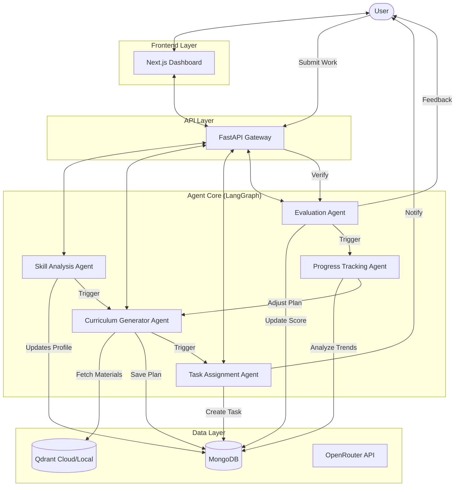

# AI Learning Coach - System Architecture & Implementation Plan

## 1. System Overview & Production Standards

The **AI Learning Coach** is a production-grade, containerized, multi-agent system designed to personalize education. It uses a feedback loop of **Analysis -> Planning -> Action -> Evaluation -> Monitoring** to adapt to the learner's needs.

### Core Principles
1.  **Fully Async**: All I/O (DB, LLM, API) must be non-blocking `async`/`await`.
2.  **Dockerized**: Each service (API, DB, VectorStore) runs in its own container.
3.  **Strict Validation**: Input/Output validated via Pydantic; no loose dictionaries.
4.  **Fault Tolerant**: Automatic retries and circuit breakers for LLM calls.

### Technology Stack
- **Backend**: Python 3.11+ with **FastAPI** (Async).
- **Agent Orchestration**: **LangChain** & **LangGraph** (Async support).
- **Database**: **MongoDB** (Motor Driver - Async) + **Beanie** (ODM).
- **Vector Database**: **Qdrant** (Dockerized).
- **Frontend**: **Next.js** (React, SSR).
- **LLM Interface**: **OpenRouter** (Async Client).
- **Infrastructure**: **Docker Compose** for local dev/prod parity.

---

## 2. Architecture & Agent Workflows

The system operates as a state machine where agents transition the user state.

### High-Level Workflow


### Agent Responsibilities

#### 1. Skill Analysis Agent (The Diagnostician)
*   **Trigger**: New user registration or "Re-calibrate" request.
*   **Input**: User goals, answers to diagnostic questions.
*   **Logic**: Uses simple conversational chain to probe knowledge depth.
*   **Output**: `SkillProfile` (JSON) - e.g., `{"python": "intermediate", "pandas": "beginner"}`.

#### 2. Curriculum Generator Agent (The Architect)
*   **Trigger**: Updated `SkillProfile`.
*   **Input**: Skill gaps, learning goals.
*   **Logic**: 
    1. Retrieve relevant topics from Vector DB.
    2. Structure topics into a sequence (Dependencies).
    3. Estimate time and difficulty.
*   **Output**: `Curriculum` object with child `Module` sequence.

#### 3. Task Assignment Agent (The Teacher)
*   **Trigger**: User starts a module or scheduled interval.
*   **Input**: Current `Module` context, past performance.
*   **Logic**:
    1. Select concept.
    2. Generate specific content (Quiz question, Coding prompt).
    3. *Optional*: Fetch supplementary reading from Vector DB.
*   **Output**: `Task` entry in DB.

#### 4. Evaluation Agent (The Grader)
*   **Trigger**: User submits `Task` response.
*   **Input**: User answer, logic/solution key, rubric.
*   **Logic**:
    1. Compare against ground truth or run code (sandbox).
    2. Generate qualitative feedback.
    3. Assign 0-100 score.
*   **Output**: `Submission` record, Score update.

#### 5. Progress Tracking Agent (The Analyst)
*   **Trigger**: Completion of Module or low scores.
*   **Input**: History of `Submission` scores.
*   **Logic**: Detect trends (e.g., "Always failing recursion").
*   **Output**: Signal to **Curriculum Agent** to re-plan (add review module) or advance user.

---

## 3. Infrastructure & Docker Architecture

The system uses `docker-compose.yml` to orchestrate services:

```yaml
services:
  backend-api:
    build: ./backend
    ports: ["8000:8000"]
    depends_on: [mongo, qdrant]
    environment:
      - DATABASE_URL=mongodb://mongo:27017
      - QDRANT_URL=http://qdrant:6333
  
  frontend-ui:
    build: ./frontend
    ports: ["3000:3000"]
  
  mongo:
    image: mongo:latest
    ports: ["27017:27017"]
    
  qdrant:
    image: qdrant/qdrant
    ports: ["6333:6333"]
```

---

## 4. Database Schema (MongoDB - Document Models)

```python
# Using Pydantic/Beanie models for reference

class SkillProfile(BaseModel):
    # e.g., {"python": 5, "sql": 2} with metadata
    skills: Dict[str, int]
    last_updated: datetime

class User(Document):
    email: Indexed(str, unique=True)
    full_name: str
    created_at: datetime
    skills_profile: SkillProfile

class Module(BaseModel):
    id: str = Field(default_factory=lambda: str(uuid4()))
    title: str
    description: str
    order_index: int
    status: str # 'pending', 'in_progress', 'completed'
    # List of topic strings or embeddings references
    topics: List[str]

class Curriculum(Document):
    user_id: PydanticObjectId
    goal: str
    active: bool
    created_at: datetime
    modules: List[Module]

class Task(Document):
    module_id: str
    user_id: PydanticObjectId
    type: str # 'quiz', 'code', 'reading'
    content: Dict[str, Any] # { "question": "...", "options": [...] }
    solution: Dict[str, Any]
    generated_by: str

class Submission(Document):
    task_id: PydanticObjectId
    user_id: PydanticObjectId
    user_input: str
    agent_feedback: str
    score: int
    submitted_at: datetime
```

---

## 4. API Interface (FastAPI)

### Authentication
*   `POST /auth/register`
*   `POST /auth/login`

### Workflow / Agent Control
*   `POST /agent/analyze` - Trigger Skill Analysis chat.
*   `POST /agent/plan` - Trigger Curriculum Generation.

### Learning Interface
*   `GET /curriculum/active` - Get the current roadmap.
*   `GET /curriculum/modules/{id}/tasks` - Get tasks for a module.
*   `POST /tasks/{id}/submit` - Submit answer -> Triggers **Evaluation Agent**.
*   `GET /progress/stats` - Get dashboard stats.

---

## 6. Implementation Roadmap

1.  **Phase 1: Infrastructure**: Create Docker Compose, Init FastAPI & Next.js projects.
2.  **Phase 2: Core Data Layer**: Setup Beanie (Mongo) and Qdrant clients with Pydantic models.
3.  **Phase 3: Agent Engine**: Implement LangGraph workflows (Async) with OpenRouter.
4.  **Phase 4: API Integration**: Connect Agents to FastAPI endpoints.
5.  **Phase 5: UI & Polish**: Complete Next.js frontend and integration.
